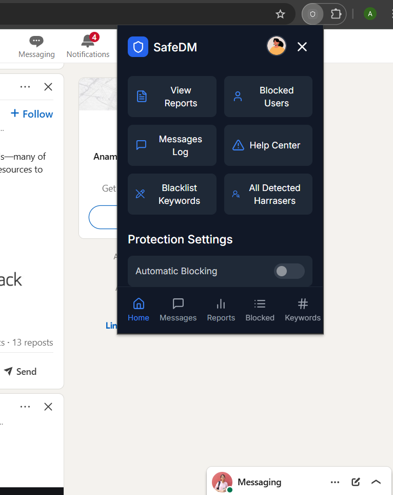
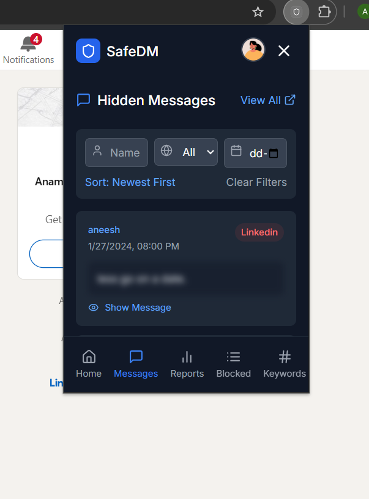
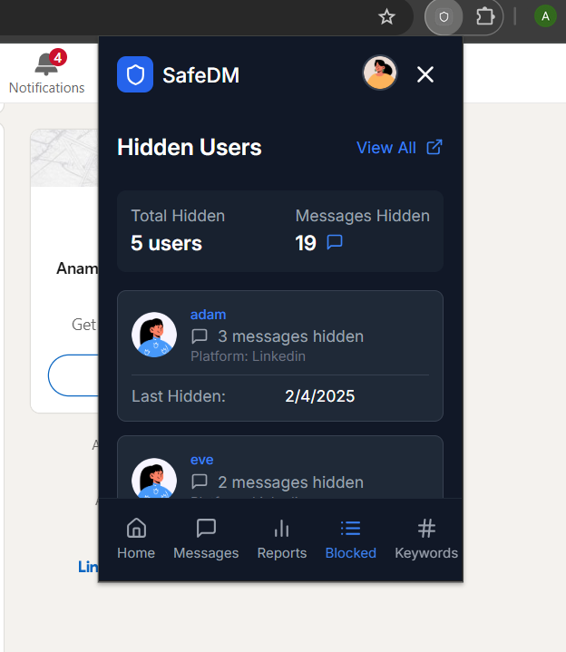
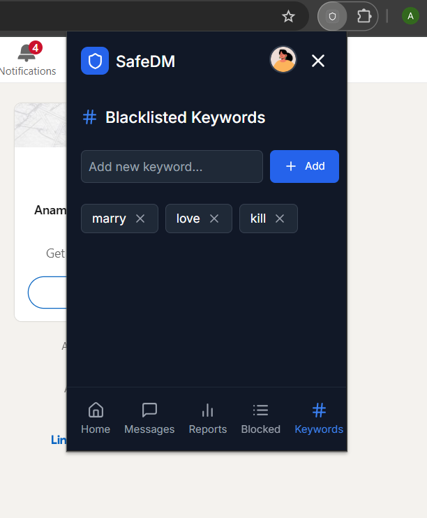
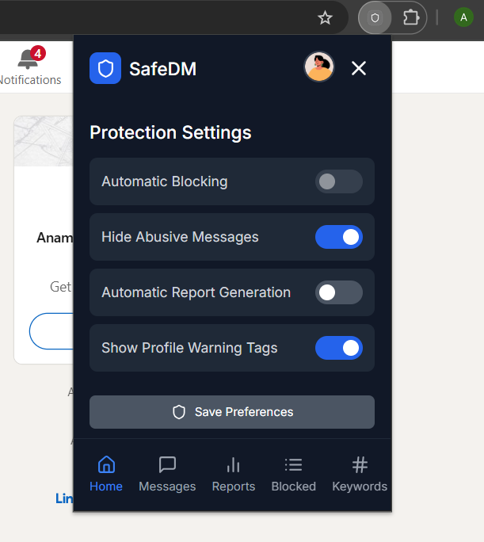

<div align="center">
  <a href="https://safire-five.vercel.app/" target="_blank">
    
  </a>
  <h2 align="center">Safire Browser Extension</h2>
</div>

This is the browser extension component of the **Safire** project. It is built using the [Plasmo](https://www.plasmo.com/) framework with React and TypeScript.

---

## Getting Started

Follow these steps to build the extension and load it into your browser for development.

### 1. Installation

Navigate to the `extension` directory and install the dependencies using `pnpm`.

```sh
cd extension
pnpm install
````

### 2. Start the Development Server

Run the development server. This will watch for file changes and rebuild the extension automatically.

```sh
pnpm dev
```

This will create a `build/chrome-mv3-dev` directory, which contains the unpacked extension files.

---

## Loading the Extension in Chrome

Since the extension is not yet on the Chrome Web Store, you need to load it manually. This is a one-time process.

1. Open **Google Chrome** and navigate to `chrome://extensions`. Or just paste this into your browser’s address bar.
2. Enable **Developer mode** using the toggle switch in the top-right corner.
3. Click the **"Load unpacked"** button that appears on the top-left.
4. In the file selection dialog, navigate to the project folder and select the `extension/build/chrome-mv3-dev` directory.
5. Click **"Select Folder"**.

The Safire extension icon  should now appear in your browser's toolbar!

---

## How to Use

* **Pin the Extension:** Click the puzzle piece icon in your Chrome toolbar and pin the Safire extension for easy access.
* **Login:** Click the extension icon to open the popup. If you're not logged in, you'll be prompted to do so. This is required to save evidence and access your dashboard.
* **Automatic Detection:** Once logged in, navigate to LinkedIn. The extension will automatically start scanning your messages in real-time.
* **Invisible Shield:** Harassing messages will be automatically hidden from view. A warning banner will appear at the top of the chat, allowing you to view the messages if you choose.

---

## Popup UI

* **Home:** Get an overview and access key protection settings.
* **Messages:** View a log of all hidden messages.
* **Reports:** See reports you've generated.
* **Blocked:** Manage users you have hidden.
* **Keywords:** Add custom keywords to the blacklist for personalized protection.

<div align="center">
     
      
      
      
      
  <br>
  <em>Harassing messages are being blocked by the extension even before the users sees them.</em>
</div>