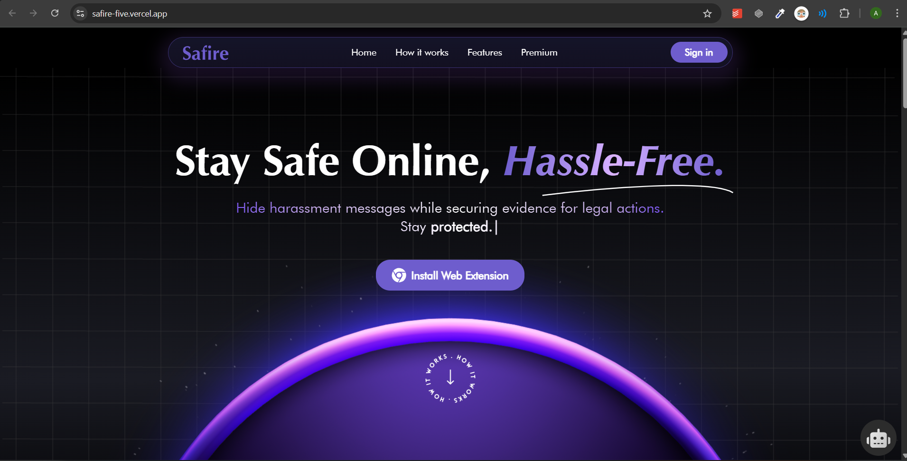
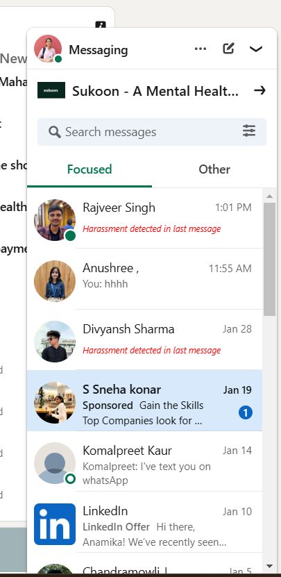
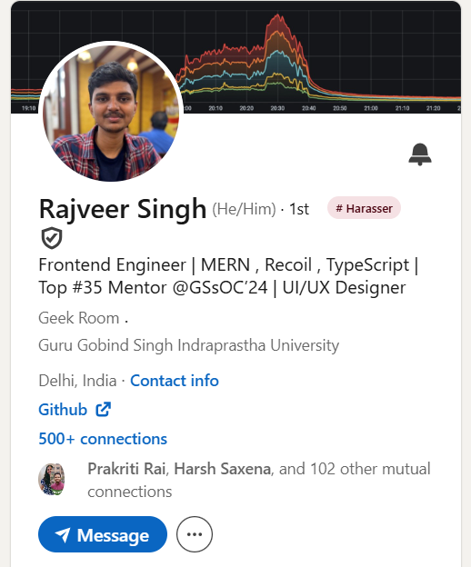
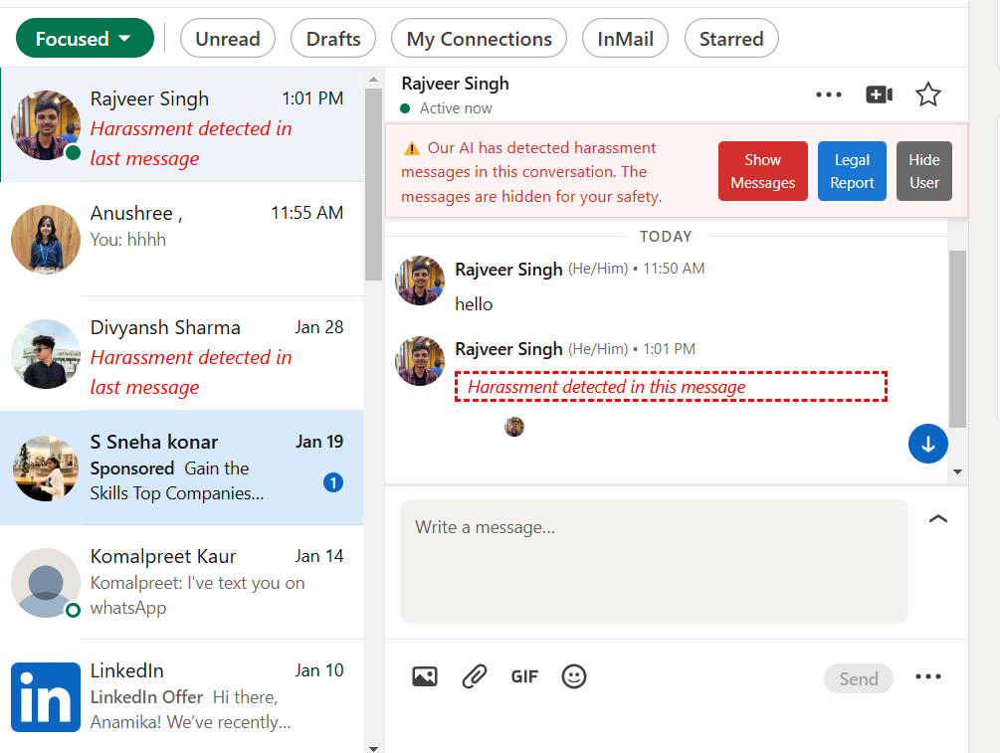

<!-- # Safire

This browser extension detects and hides harassment messages to create a safer online experience for professional platforms like LinkedIn.

## 🎥 Demo Video (click to play)

[](https://vimeo.com/1059208124)


## Features

✅ **AI-powered detection**  
Automatically identifies harassment messages.

✅ **Protects users**  
Hides detected messages to prevent trauma.

✅ **Login functionality**  
Save messages to a database for report generation.

✅ **User blocking**  
Hide messages from specific users permanently.

✅ **Harasser tagging**  
Automatically tags users if blocked by more than 5 users.

✅ **Comprehensive Stats & Control**  
View saved messages, blocked users, blocked keywords, generated reports, and modify extension preferences effortlessly.

---


## Screenshots

### UI MODIFICATION BY EXTENSION

  

  

  


### 📊 EXTENSION POPUP - STATS OVERVIEW

  

  

  

  

  


---


## 🛠 Installation

1️⃣ **Clone this repository:**  
   ```sh
   git clone https://github.com/rajveeerr/Safire.git
   ```

2️⃣ **Navigate to the project folder:**  
   ```sh
   cd Safire/extension
   ```

3️⃣ **Install dependencies:**  
   ```sh
   npm i -g pnpm
   pnpm i
   ```

4️⃣ **Start the development server:**  
   ```sh
   pnpm dev
   ```

5️⃣ **Open Chrome and navigate to:**  
   ```
   chrome://extensions/
   ```

6️⃣ **Enable Developer mode** (toggle in the top right corner).

7️⃣ **Click on Load unpacked and select the folder:**  
   ```
   Harassment-Saver-Extension/extension/build/chrome-mv3-dev
   ```

---
## 🚀 Usage

1️⃣ **Install the extension following the steps above.**  

2️⃣ **The extension will automatically detect and hide harassment messages.**  

3️⃣ **Users can manually review hidden messages if needed.**  

 -->
<div align="center">
  <a href="https://safire-five.vercel.app/" target="_blank">
    
  </a>
  <h1 align="center">Safire - The Harassment Saver</h1>
  <p align="center">
    A real-time, AI-powered browser extension to detect, hide, and document online harassment, creating a safer digital space for everyone.
  </p>
  <p align="center">
    <a href="https://vimeo.com/1059493429?share=copy"><strong>Watch the Demo »</strong></a>
    <br />
    <a href="https://safire-five.vercel.app/">View Landing Page</a>
    ·
    <a href="https://github.com/rajveeerr/Safire/issues">Report Bug</a>
    ·
    <a href="https://github.com/rajveeerr/Safire/issues">Request Feature</a>
  </p>

  <!-- BADGES -->
  <p align="center">
    
    
    
  </p>
</div>

---

## Hackathon Achievements

Safire has been recognized for its innovative approach and social impact at multiple hackathons. We are proud to have won:

- **1st Winner at CodeKshetra2.0**
- **First Prize at HackWie**
- **Best Impact Project at SheBuilds**

---

## Demo Video

[](https://vimeo.com/1059493429?share=copy)
*(Click the image above to watch the full demo on Vimeo)*

---

## The Problem

Online harassment is a critical social issue, disproportionately affecting women and marginalized communities. Existing anti-harassment tools are often inadequate:
- **Reactive, not Proactive**: Users experience trauma *before* any action can betaken.
- **Ineffective Blocking**: Traditional blocking can escalate the situation, as harassers simply create new accounts.
- **Lack of Evidence**: Manually collecting evidence for legal action is difficult, stressful, and often incomplete.
- **Slow Manual Reporting**: Platform reporting systems are slow and often ineffective, leaving victims unprotected.

<div align="center">
  <a href="https://drive.google.com/file/d/1XuOpAc2S8qeLWhWpD5HGfEtjNZ-d_To4/view?usp=share_link" target="_blank">  
     

  </a>
  <br>
  <em>Click the image above to view the full presentation</em>
</div>

---

## Our Solution: Safire

Safire is a browser extension that acts as your personal guardian against online harassment. It uses advanced AI to analyze messages in real-time, proactively hiding harmful content before you see it. Safire silently collects evidence, empowers you to take legal action, and helps create a safer online community.

<div align="center">
  <a href="https://drive.google.com/file/d/1XuOpAc2S8qeLWhWpD5HGfEtjNZ-d_To4/view?usp=share_link" target="_blank">
     
  </a>
  <br>
  <em>Click the image above to view the full presentation</em>
</div>

---

## Key Features

Safire is packed with features designed to provide comprehensive protection and peace of mind.

| Feature                  | Description                                                                                                                              |
| ------------------------ | ---------------------------------------------------------------------------------------------------------------------------------------- |
| 🛡️ **AI-Powered Detection**    | Utilizes Natural Language Processing (NLP) to detect both obvious and subtle forms of harassment in real-time.                         |
| 👻 **Invisible Shield**         | Automatically hides harassing messages without alerting the sender, preventing retaliation and further trauma.                       |
| 📂 **Automated Evidence**      | Captures tamper-proof screenshots with metadata (timestamps, sender details) and stores them securely for 30 days.                     |
| 📄 **One-Click Legal Reports** | Generates detailed, evidence-backed PDF reports formatted for submission to authorities or platform moderators.                        |
|  community-driven **Harasser Tagging**    | A visible "Harasser" tag is added beside a user's name if they have been hidden by 5+ users, creating community awareness. |
| 📊 **User Dashboard**          | A central hub to view harassment analytics, manage hidden users, customize keywords, and access generated reports.                     |
| 🌐 **Cross-Platform**          | Initially for LinkedIn, with plans to expand to Twitter, Instagram, WhatsApp, and more.                                                |

---

## Tech Stack

This project is a monorepo combining a web app, browser extension, and multiple backend services.

| Component                  | Technologies                                                                                                   |
| -------------------------- | -------------------------------------------------------------------------------------------------------------- |
| 🌐 **Landing Page**        | [React](https://reactjs.org/), [Vite](https://vitejs.dev/), [Tailwind CSS](https://tailwindcss.com/), [Framer Motion](https://www.framer.com/motion/) |
| 📊 **User Dashboard**      | [Next.js](https://nextjs.org/), [TypeScript](https://www.typescriptlang.org/), [Tailwind CSS](https://tailwindcss.com/), [shadcn/ui](https://ui.shadcn.com/) |
| 🧩 **Browser Extension**   | [Plasmo](https://www.plasmo.com/), [React](https://reactjs.org/), [TypeScript](https://www.typescriptlang.org/), [Upstash](https://upstash.com/) (for caching) |
| ⚙️ **Main Backend Server** | [Node.js](https://nodejs.org/), [Express](https://expressjs.com/), [MongoDB](https://www.mongodb.com/), [JWT](https://jwt.io/), [Puppeteer](https://pptr.dev/) |
| 🤖 **AI Moderation Server**| [Node.js](https://nodejs.org/), [Express](https://expressjs.com/), [Google Gemini AI](https://ai.google.dev/)          |

---

## Wireframes & Screenshots

We went from initial low-fidelity wireframes to a polished final product in a short amount of time.

<details>
<summary><strong>Click to view Wireframes and Screenshots</strong></summary>
<br>

**Initial Wireframes:**
<div align="center">
  <a href="https://app.eraser.io/workspace/JUmzwgvpm12ATQiWXZUU?origin=share" target="_blank">
     
  </a>
  <br>
  <em>Click the image above to view the full wireframe</em>
</div>

**Extension in Action:**
<div align="center">
     
      
      
  <br>
  <em>Harassing messages are being blocked by the extension even before the users sees them.</em>
</div>


**Dashboard UI:**
<div align="center">
  <a href="https://safe-dm-dashboard.vercel.app/" target="_blank">
    
  
  </a>
  <br>
  <em>Click the image above to create your account and view dashboard.</em>
</div>

**Generated Legal Report:**
<div align="center">
  <a href="https://drive.google.com/file/d/100yg2kfhHHoeIC910DvbznlqmIDm0tjL/view?usp=sharing" target="_blank">
     
  </a>
  <br>
  <em>Click the image above to view the full report</em>
</div>


</details>

---

## Getting Started: Local Setup

To get a local copy of **Safire** up and running on your machine, follow these simple steps.

---

### 🧰 Prerequisites

Before you begin, make sure you have the following tools installed:

- [**Node.js**](https://nodejs.org/) (v18 or higher recommended)
- [**pnpm**](https://pnpm.io/installation) – Install globally using:

  ```sh
  npm install -g pnpm
    ```

* [**MongoDB**](https://www.mongodb.com/try/download/community) – Either a local instance or a cloud setup (e.g., MongoDB Atlas)

---

### 📦 Installation & Setup

#### 1. Clone the Repository

Use Git to clone the Safire project:

```sh
git clone https://github.com/rajveeerr/Safire.git
cd Safire
```

---

#### 2. Choose a Project Component

This is a **monorepo** that contains several independent components:

| Directory            | Description                           | Setup Guide                                                  |
| -------------------- | ------------------------------------- | ------------------------------------------------------------ |
| `client/`            | Public-facing landing page            | [`client/README.md`](client/README.md)                       |
| `dashboard/`         | User dashboard web application        | [`dashboard/README.md`](dashboard/README.md)                 |
| `extension/`         | Chrome browser extension              | [`extension/README.md`](extension/README.md)                 |
| `server/`            | Main backend API                      | [`server/README.md`](server/README.md)                       |
| `moderation-server/` | AI-based text moderation microservice | [`moderation-server/README.md`](moderation-server/README.md) |

---

#### 3. Set Up a Component

Navigate into the component you'd like to work on and follow its README for full setup instructions.

For example, to set up the **browser extension**, run:

```sh
cd extension
pnpm install
pnpm dev
```

Then follow the rest of the [extension's README](extension/README.md) to load it in Chrome.

---

> 💡 Each component is self-contained and can be developed/tested independently.

## Contributors

This project was brought to life by the team "Smooth Operators".

| Name               | GitHub Profile                               |
| ------------------ | -------------------------------------------- |
| **Rajveer Singh**  | [@rajveeerr](https://github.com/rajveeerr)     |
| **Anamika Aggarwal** | [@Anamika1608](https://github.com/Anamika1608) |
| **Divyansh Sharma**| [@divyansharma001](https://github.com/divyansharma001)|
| **Anushree**       | [@ashree2118](https://github.com/ashree2118)       |

---

## 🌱 A Note on Our Development Journey

As a project born from the fast-paced and dynamic environment of hackathons, our codebase was migrated between private repositories several times during its initial development. This was necessary to meet deadlines and adapt to evolving requirements.

Consequently, the commit history visible here doesn't fully capture the extensive, iterative process—and the hundreds of commits—that went into building Safire from the ground up. The current history reflects the final, polished state of the project as we prepared it for the public.

We share this note to provide context on our journey and to give a nod to the immense effort, late nights, and passion our team poured into bringing this idea to life.

---
